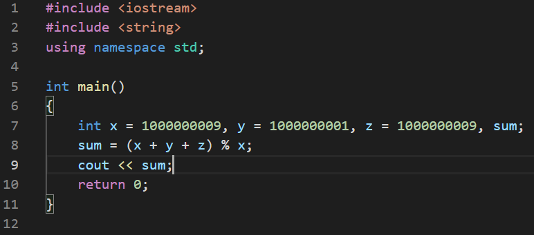
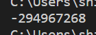
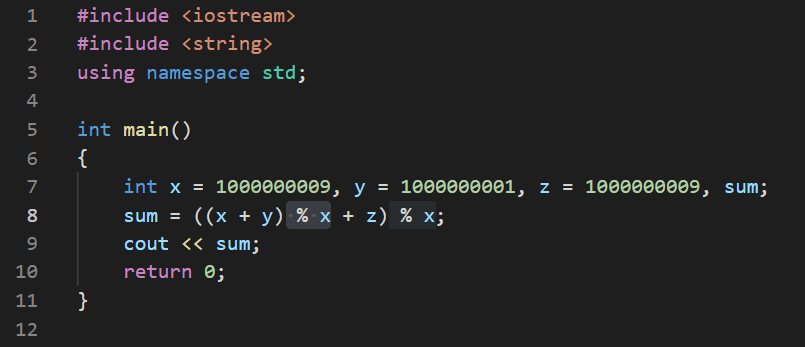
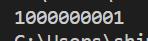

# 15988번 1, 2, 3 더하기 3

[백준 15988번 1, 2, 3 더하기 3 문제](https://www.acmicpc.net/problem/15988)  

- 모든 경우의 수는 `(수의 개수) ! / (같은 수를 묶었을 때 그 안에서 각자 자리를 바꿀 수 있는 수)! `이다. 예시를 하나 들어보면, 아래와 같다.

  - 예) n이 5일 경우, 1 1 1 2 의 숫자만을 사용할 경우의 수는 `4! / 3! ` 이다.

- **n을 1, 2, 3의 합으로 나타내는 방법의 수**를 찾는 문제인데, 1, 2, 3은 합이 아닌 자기자신의 수 하나만을 가지는 경우도 포함한다.

- 문제에서 **합을 나타낼 때는 수를 1개 이상 사용해야 한다.** 라고 나와있기 때문에 자기 자신의 수 1개의 경우가 포함된다.

- 하나씩 경우의 수를 구해보면 규칙이 보이게 된다.

- | 정수 n         | 1    | 2    | 3    | 4     | 5     | 6      | 7       |
  | -------------- | ---- | :--- | ---- | ----- | ----- | ------ | ------- |
  | 방법의 수      | 1    | 2    | 4    | 7     | 13    | 24     | 44      |
  | 앞 수와의 비교 | .    | 1+1  | 2+2  | 4+3   | 7+6   | 13+11  | 24 +20  |
  | 규칙           | .    | .    | .    | 3=1+2 | 6=2+4 | 11=7+4 | 20+7+13 |

- 표를 보면, 정수 4의 경우부터 자신의 앞 정수 3의 방법 + 앞의 두 수의 경우(정수 1 , 정수 2의 경우)를 더한 것과 같다. 

- 즉 정수 N 의 경우의 수는 `(N-1)의 경우 + (N-2)의 경우 + (N-1)의 경우` 의 수와 같다.

- 이 문제에서 주의할 점은 수의 범위이다.

- 각 수를 3번 더해야 하므로 더하는 도중에 int의 범위가 넘어갈 수 있다.

- 따라서 int의 자료형으로 배열과 함수의 return 형식을 정하였으면, 한번을 더하면 한번을 다시 나누어 주어야 한다. 그렇지 않다면 long long의 자료형을 사용해야 한다.










< int 자료형 >

 ```c++
#include <iostream>
#include <algorithm>
#include <cstdio>
#include <cstring>
#include <vector>
#include <queue>
#define Div 1000000009
using namespace std;
int t;
int arr[1000001] = {0, 1, 2, 4};
int dp(int num)
{
    if (arr[num] == 0)
    {
        arr[num] = (((dp(num - 1) + dp(num - 2)) % Div) + dp(num - 3)) % Div;
        return arr[num];
    }
    else
        return arr[num];
}
int main()
{
    cin >> t;
    for (int i = 0; i < t; i++)
    {
        int k;
        cin >> k;
        cout << dp(k) << '\n';
    }
    return 0;
}

 ```

 < long long 자료형 >

```c++
#include <iostream>
#include <algorithm>
#include <cstdio>
#include <cstring>
#include <vector>
#include <queue>
#define Div 1000000009
using namespace std; 
int t;
long long arr[1000001];
long long dp(int num)
{
    if (num == 1)
        return 1;
    if (num == 2)
        return 2;
    if (num == 3)
        return 4;
    if (arr[num] != 0)
        return arr[num];
    else
    {
        arr[num] = (dp(num - 1) + dp(num - 2) + dp(num - 3)) % Div;
        return arr[num];
    }
}
int main()
{
    cin >> t;
    for (int i = 0; i < t; i++)
    {
        int k;
        cin >> k;
        cout << dp(k) << '\n';
    }
    return 0;
}

```

